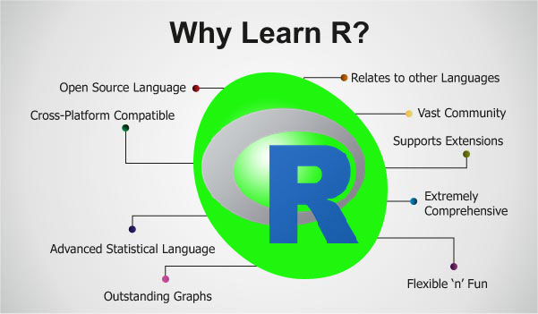

*** 

FOCUS IMPORT AND EXPORT ISSUES WITH R DEDICATED AFFECTS OF INLATION, CURRENCY AND FOREIGN EXCHANGE RATES

***  

## PROJECT TEAM MEMBERS
*** 
   
     

**GITHUB PAGES**

- [Büşra Nur Aydemir](https://mef-bda503.github.io/pj18-aydemirbusra/) - [Leyla Yiğit](https://mef-bda503.github.io/pj18-Leyla.Yigit/)

- [Mehmet Ak](https://mef-bda503.github.io/pj18-mehmetakk/) - [Mercan Karacabey](https://mef-bda503.github.io/pj18-mkaracabey/)

- [Merve Özen Şahin](https://mef-bda503.github.io/pj18-ozenm/)

**LINKEDIN**
- [Büşra Nur Aydemir]( https://www.linkedin.com/in/busra-nur-aydemir-51b81b8b/) - [Leyla Yiğit](https://www.linkedin.com/in/leyla-yi%C4%9Fit-b3894955/)

- [Mehmet Ak](https://www.linkedin.com/in/ACoAACENGXUBEHApr9slAuQzh8lBviwp1FrY3oY/)- [Mercan Karacabey](https://www.linkedin.com/in/mercan-karacabey-708240103/)

- [Merve Özen Şahin](https://www.linkedin.com/in/merve-ozen-sahin-91027431/)

***
## PROJECT SCOPE 
*** 
**Reason to Project Topic**

**Project Executive Summary**

**Project Analysis Diagrams**

***
## DATA SET 
*** 
**Excel Raw Data Set**

[For Export Data Click]("https://github.com/MEF-BDA503/gpj18-r_coders/blob/master/Data_Sources(Excel)/export_1996_2018.xls")

[For Import Data Click]("https://github.com/MEF-BDA503/gpj18-r_coders/blob/master/Data_Sources(Excel)/import_1996_2018.xls")

[For Interest Rate Data Click]("https://github.com/MEF-BDA503/gpj18-r_coders/blob/master/Data_Sources(Excel)/Interest.xlsx")

[For Producer Inflation Click]("https://github.com/MEF-BDA503/gpj18-r_coders/blob/master/Data_Sources(Excel)/Producer_Inflation.xlsx")

[For US Dollar Montly Rate Click]("https://github.com/MEF-BDA503/gpj18-/blob/master/Data_Sources(Excel)/US_Dollar_Montly_Rate.xlsx")

**RDS Data Set**

***
## DATA PREPERATION AND ANALYSIS
*** 
**RMD FILES**

**ANALSIS WITH R**

***
## DATA VISUALIZATION WITH R
*** 
## SHINY ##
[For Shiny Click](https://rcoders.shinyapps.io/shiny/)

## PROJECT DOCUMENTATION
*** 
**PROJECT REPORT**

**PROJECT PRESENTATION**

***
## REFERENCES AND CITATIONS
*** 
**REFERENCES**

[For References Clik](Analysis_Codes_and_RMD_HTML/References.html)

**CITATIONS**

[Thanks to Martijn Theuwissen for loops](https://www.r-bloggers.com/how-to-write-the-first-for-loop-in-r/)

[Thanks group four for data manupulation](https://mef-bda503.github.io/gpj18-group_four/)

***

**[Course Homepage](https://mef-bda503.github.io/)**

**[Project Documents On Githup](https://github.com/MEF-BDA503/gpj18-r_coders)**
